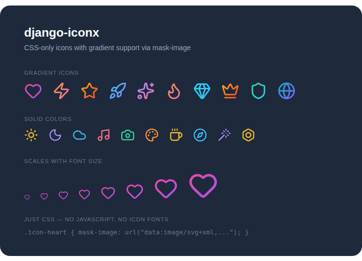

# django-iconx

[](https://pypi.org/project/django-iconx/)
[](https://pypi.org/project/django-iconx/)
[](https://github.com/oliverhaas/django-iconx/actions/workflows/ci.yml)

CSS-only icon system for Django.



Generates a single CSS file from SVG icon sources (e.g. Lucide, Heroicons, or your own SVGs). Icons are rendered purely via CSS, no JavaScript or icon fonts needed. A template tag is included for convenience but not required.

## Usage

```html
<!-- basic icon -->
<i class="icon icon-search" aria-hidden="true"></i>

<!-- sized via Tailwind text-* (width/height = 1em, so font-size controls size) -->
<i class="icon icon-check text-2xl" aria-hidden="true"></i>

<!-- colored via Tailwind text-* (mono icons only, via currentColor mask trick) -->
<i class="icon icon-check text-2xl text-green-500" aria-hidden="true"></i>

<!-- multi-color icon (preserves original SVG colors) -->
<i class="icon icon-logo text-4xl" aria-hidden="true"></i>
```

## How it works

Mono icons use `mask-image` with `background-color: currentColor`, so the SVG acts as a mask and the icon inherits text color. Multi-color icons use `background-image` to render the SVG as-is.

```css
/* base: all icons */
.icon { display: inline-block; width: 1em; height: 1em; }

/* mono icons: grouped selector */
.icon-search, .icon-check, ... {
  background-color: currentColor;
  mask-size: contain;
  mask-repeat: no-repeat;
  mask-position: center;
  mask-mode: alpha;
}

/* individual mask per icon */
.icon-search { mask-image: url("/static/icons/search.svg"); }

/* multi-color icons: grouped selector */
.icon-logo, .icon-badge, ... {
  background-size: contain;
  background-repeat: no-repeat;
  background-position: center;
}

.icon-logo { background-image: url("/static/logos/logo.svg"); }
```

Key design choices:
- **`currentColor`**: mono icons inherit text color automatically
- **`1em` sizing**: icons scale with font size via Tailwind `text-*` classes
- **`mask-mode: alpha`**: SVG alpha channel drives the mask, fill colors are irrelevant
- **Direct element styling**: no `::before` pseudo-element, simpler CSS
- **Tree-shakeable**: PurgeCSS strips unused `.icon-*` rules from the generated CSS

## Browser support

django-iconx uses CSS `mask-image`, which is supported unprefixed in all modern browsers since December 2023 (~97% global coverage). Older browsers (Chrome < 120, Safari < 15.4) need the `-webkit-mask-image` prefix.

Tailwind v4 handles vendor prefixing automatically. Just `@import` the generated CSS file in your Tailwind entry point:

```css
@import "tailwindcss";
@import "./static/iconx/icons.css";
```

With vendor prefixes applied, the only unsupported browsers are pre-Chromium Edge (≤ 18) and Internet Explorer.

## Installation

```console
pip install django-iconx
```

## Documentation

Full documentation at [oliverhaas.github.io/django-iconx](https://oliverhaas.github.io/django-iconx/)

## License

MIT
